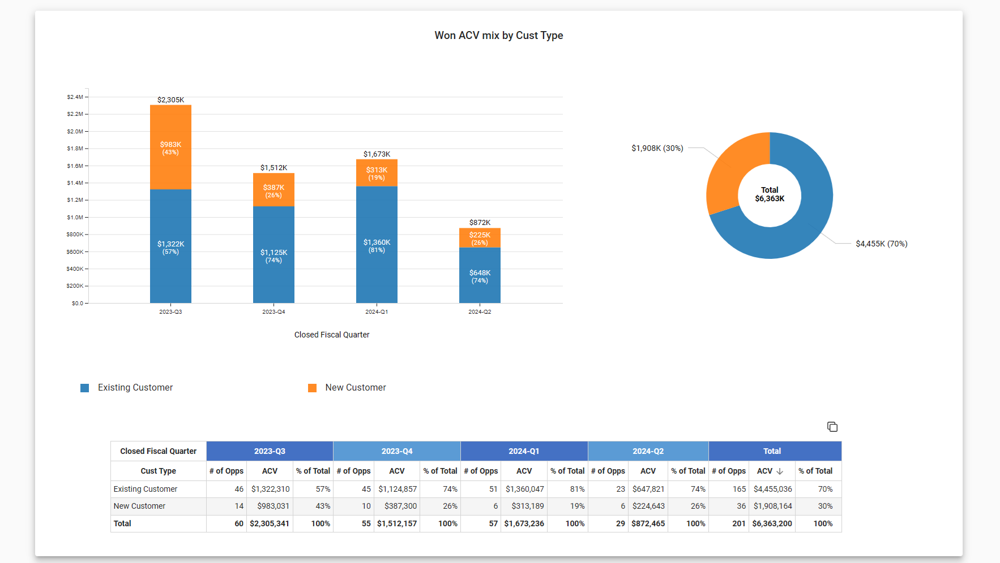

# SkyGeni

A comprehensive sales performance dashboard application with a modern frontend and robust backend.




## Project Overview

SkyGeni is a full-stack application that provides detailed sales performance analytics through an interactive dashboard. The application consists of two main components:

1. **Frontend**: A React-based dashboard with Material-UI components and Redux
2. **Backend**: A TypeScript Express.js server

## Project Structure

```
skygeni/
├── skygeni-frontend/     # Frontend application
│   ├── src/
│   │   ├── components/   # React components
│   │   ├── redux/        # State management
│   │   ├── types/        # TypeScript definitions
│   │   └── utils/        # Utility functions
│   │   └── redux/        # Redux related files
│   └── App.tsx           # App Component
│   └── main.tsx          # Main entry point
│   └── package.json      # Frontend dependencies
│
└── skygeni-backend/      # Backend server
    ├── src/
    │   ├── controllers/  # Route controllers
    │   ├── routes/       # API routes
    │   ├── types/        # Type definitions
    │   ├── utils/        # Utility functions
    │   └── index.ts      # Entry point
    └── package.json      # Backend dependencies
```

## Frontend Features

- **Interactive Dashboard**
  - Customer Type Distribution
  - Industry Segmentation
  - ACV Range Analysis
  - Team Performance Metrics
- **Modern UI Components**
  - Material-UI based design
  - Responsive layout
  - State management with Redux
  - Dynamic charts and graphs with D3
  - Animated transitions

## Backend Features

- **RESTful API**
  - Dashboard data endpoints
  - Health check endpoints
- **Data Processing**
  - Customer data processing
  - Industry data analysis
  - ACV range calculations
  - Team performance metrics

## Technologies Used

### Frontend
- React with TypeScript
- Material-UI
- Redux for state management
- D3.js for data visualization
- Vite for build tooling

### Backend
- Node.js
- Express.js
- TypeScript
- ESLint for code quality

## Getting Started

### Prerequisites
- Node.js (v14 or higher)
- npm or yarn

### Installation

1. Clone the repository:
```bash
git clone https://github.com/asif-sidd9768/skygeni.git
cd skygeni
```

2. Install frontend dependencies:
```bash
cd skygeni-frontend
npm install
```

3. Install backend dependencies:
```bash
cd ../skygeni-backend
npm install
```

### Update .env in both frontend and backend by referring .env.example

### Running the Application

1. Start the backend server:
```bash
cd skygeni-backend
npm run dev
```

2. Start the frontend development server:
```bash
cd skygeni-frontend
npm run dev
```

The application will be available at:
- Frontend: http://localhost:5173
- Backend: http://localhost:3000

## Available Scripts

### Frontend
- `npm run dev` - Start development server
- `npm run build` - Build for production
- `npm run lint` - Run ESLint
- `npm run preview` - Preview production build

### Backend
- `npm run build` - Compile TypeScript code
- `npm start` - Start the compiled server
- `npm run dev` - Start development server with hot-reload

## API Documentation

### Dashboard Routes
- `GET /api/dashboard` - Retrieve dashboard data

### Health Check
- `GET /health` - Check server health

## Acknowledgments

- Material-UI for the component library
- D3.js for visualization capabilities
- Redux team for state management
- Vite for the build tool
- Express.js team for the web framework 